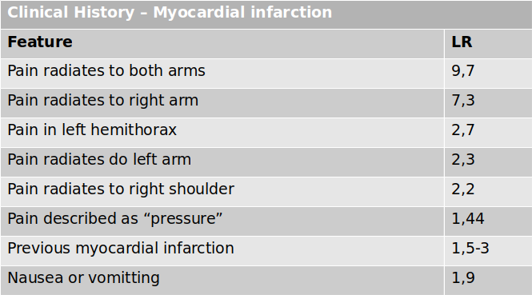
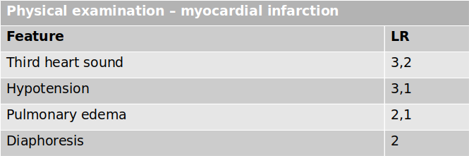
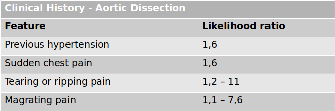
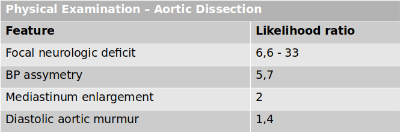
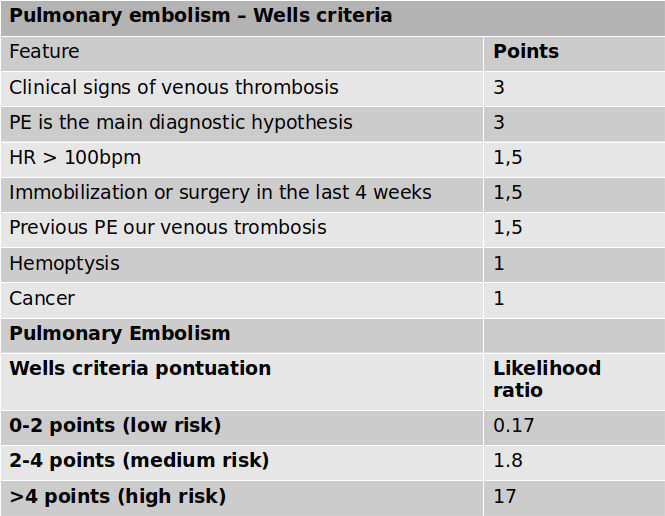
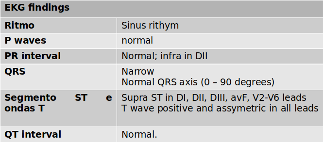
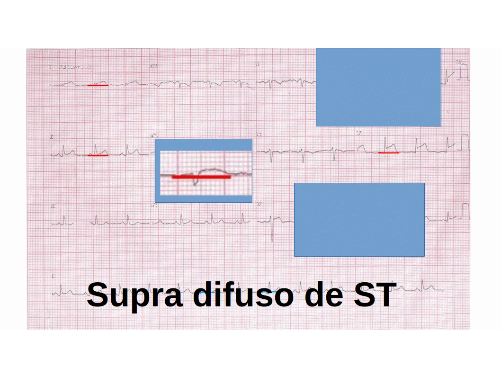

== Case 001 (start,dialog_left) ==
:NURSE Agnes: Doctor, we have a man (51 years old) who entered the emergency department reporting chest pain. His vital signs are ABP: 144x92mmHG; HR: 78bpm; RR: 21rpm; Temp: 37oC; O2Sat: 98%.

++ Let us go! (talk-action) -> Level 1

== Level 1 (decision) ==

:PATIENT Jakob: Doctor, I am feeling chest pain since yesterday. The pain is continuous and is located just in the middle of my chest, worsening when I breathe and when I lay down on my bed. I suffer from arterial hypertension and smoke 20 cigarettes every day. My father had a “heart attack” at my age and I am very worried about it.

<b>PHYSICAL EXAMINATION</b>   The cardiac and pulmonary auscultation are normal; chest pain does not worse with palpation of the thorax; there is no jugular stasis nor lower limb edema.

++ Generate hypothesis (action-1) -> Generate hypothesis 1
++ More information (action-2) -> More information 1
++ Call the supervisor (action-3) -> Call the supervisor 1

== Generate hypothesis 1 (input) ==
:PATIENT Jakob:.
{?1 hypothesis:mesh#pericarditis,myopericarditis,pericardial inflammation,pericardial infection,pericardial effusion;infarction,myocardial infarction,coronary syndrome,acute coronary syndrome,ischemia,myocardial ischemia,coronary insufficiency,angina,angina pectoris}

++ Submit hypothesis (submit-input) -> Check hypothesis 1

== More information 1 (information) ==

:PATIENT Jakob: <b>MORE INFORMATION</b>   The patient never felt chest pain before. He exercises regularly and has lost weight in the last three months. He takes amlodipine and losartan regularly. Two weeks ago, he had an auto-limited gastroenteritis episode. He denies recent travels and surgery .

++ Generate hypothesis (action-1) -> Generate hypothesis 1
++ Call the supervisor (action-2) -> Call the supervisor 1a

== Call the supervisor 1a (detailed) ==
:SUPERVISOR Harry:.
Hi! I am glad that you called me. Chest pain is an important complaint at the emergency department and we have to exclude the fatal causes: myocardial infarction (MI), acute aortic dissection (AAD), pulmonary embolism PE), hypertensive pneumothorax (HP), and Boerhaave Syndrome (BS).

The best way to find out what is happening with your patient, my young padawan, is to gather as much information as possible through history taking and physical examination. We need to search for the signs and symptoms that can guide our clinical reasoning process by changing the pre-test probabilities of each disease.

++ See likelihood tables (action-1) -> Call the supervisor 1b 

== Call the supervisor 1b (detailed) ==
:SUPERVISOR Harry:.
Do you know the concept of Likelihood ratio (LR)? -> Likelihood Ratio

++ Clinical History Myocardial Infarction
++ Physical Examination Myocardial Infarction
++ Clinical History Aortic Dissection
++ Physical Examination Aortic Dissection
++ Pulmonary Embolism Wells Criteria

++ Continue talking (action-1) -> Call the supervisor 1c 

== Call the supervisor 1c (detailed) ==
:SUPERVISOR Harry:.
Hypertensive pneumothorax is more common in tall and thin young adults (primary pneumothorax) or in patients with chronic pulmonary diseases or chest trauma (secondary pneumothorax). On physical examination, we expect asymmetry in lung auscultation and the trachea may be dislocated to the contralateral side of the pneumothorax.

Boerhaave Syndrome is more common in patients who presented vomiting before the chest pain started, were submitted to endoscopic procedures or had chest trauma.

How does this information can help you to solve your case?

++ Back to the case (action-1) -> Level 1

== Likelihood Ratio (detailed) ==

Likelihood ratio (LR) - like sensitivity and specificity, LR describe the discriminatory power of features in a clinical context, estimating the probability of disease. When the LR is higher than 1, the feature increases the probability; when lower than 1, reduces it.

++ Back (action-1) -> Call the supervisor 1

== Clinical History Myocardial Infarction (detailed) ==

++ Back (action-1) -> Call the supervisor 1

== Physical Examination Myocardial Infarction (detailed) ==

++ Back (action-1) -> Call the supervisor 1

== Clinical History Aortic Dissection (detailed) ==

++ Back (action-1) -> Call the supervisor 1

== Physical Examination Aortic Dissection (detailed) ==

++ Back (action-1) -> Call the supervisor 1

== Pulmonary Embolism Wells Criteria (detailed) ==

++ Back (action-1) -> Call the supervisor 1

== Check hypothesis 1 (check_input) ==

{{symptoms#contribution to diagnostics: ,+,=,-;lightgrey,green,blue,red
Nurse: Doctor, please you have to evaluate a {man(male)} ({51 years-old(aging=51)#=}) who entered the emergency department reporting {chest pain#=}.His vital signs are {ABP: 144x92mmHG#=}; {HR: 78bpm#=}; {RR: 21rpm#=}; {Temp: 37oC#=}; {O2Sat: 98%#=}.

Patient: Doctor, I am feeling chest pain since yesterday. The {pain is continuous#=} and {is located just in the middle of my chest#=}, {worsening when I breathe#+} and {when I lay down on my bed#+}. I have {arterial hypertension#-} and {I smoke 20 cigarettes(smoking=20/day)#-} every day. {My father had a "heart attack"#-} at my age and I am very worried about it.

You perform physical examination: {cardiac and pulmonary auscultation are normal#-}; {chest pain does not worse with palpation of the thorax#=}; {there is no jugular stasis#=} {nor lower limb edema#=}.
}}
++ Submit (submit-input) -> Order EKG 

== Order EKG (decision_eletro) ==
Our patient denies any recent long trip, immobilization or surgery.

The blood pressure is symmetric in the four limbs. 

Game: What do you want to do?
++ Generate hypothesis (action-1) -> Generate hypothesis 2
++ More information (action-2) -> More information 2
++ Call the supervisor (action-3) -> Call the supervisor 2

++ Magnify (ekg-image) -> Magnify EKG

== Magnify EKG (magnify_eletro) ==

== Generate hypothesis 2 (input) ==
:PATIENT Jakob:.
{?1 hypothesis:mesh#pericarditis,myopericarditis,pericardial inflammation,pericardial infection,pericardial effusion;infarction,myocardial infarction,coronary syndrome,acute coronary syndrome,ischemia,myocardial ischemia,coronary insufficiency,angina,angina pectoris}

++ Submit hypothesis (submit-input) -> Check hypothesis 2

== More information 2 (details_eletro) ==

EKG description

++ EKG Analysis (action-1)

== EKG Analysis (notice) ==

Image zoom.

== Call the supervisor 2 (presentation,notice) ==

We did not find features that increase the likelihood of myocardial ischemia. Moreover, our patient has a pleuritic chest pain that gets worse when the patient lays down.

In the EKG we found ST-segment elevation in almost all leads. Also, we found a depression of the PR segment in the DII lead.

== Check hypothesis 2 ==

++ Submit -> Final report

== Final report ==
# Feedback
Score: ...
Evaluation: ...
Two columns