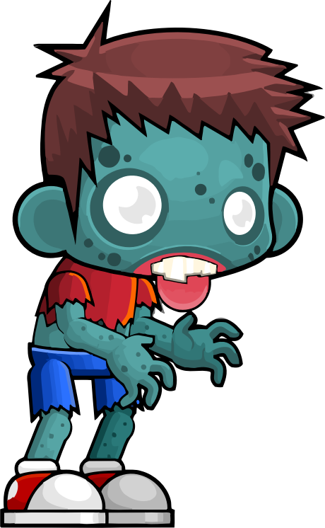

# Lingua vermelha (notice) #

A língua está vermelha.
# Lingua amarela (notice) #

A língua está amarela.
# Sem Paralisia (notice) #

O está com bons movimentos.
# Paralisia (notice) #

O corpo está paralisado.
# Dedos ok (notice) #

A mãos não têm nenhuma irregularidade observável.
# Dedos tremendo (notice) #

Os dedos mindinhos estão tremendo.
# Membros ok (notice) #

Todos os membros estão no lugar.
# Perda membros (notice) #

Foram perdidos alguns membros.
# Sem dor (notice) #

Não tem nenhuma queixa de dor.
# Dor no peito (notice) #

Sente uma forte dor no peito.
# Sem raiva (notice) #

Está de bom humor apesar de tudo.
# Com raiva (notice) #

Sente uma grande raiva.
# Bacterias certo (notice right) #

Parabéns você tratou corretamente uma infecção por bactérias.
# Bacterias errado (notice wrong) #

Infelizmente você fez o tratamento incorreto, era uma infecção por bactérias.
# Virus certo (notice right) #

Parabéns você tratou corretamente uma infecção por vírus.
# Virus errado (notice wrong) #

Infelizmente você fez o tratamento incorreto, era uma infecção por vírus.
# Zulumbriga certo (notice right) #

Parabéns você tratou corretamente uma infecção por zulumbriga.
# Zulumbriga errado (notice wrong) #

Infelizmente você fez o tratamento incorreto, era uma infecção por zulumbriga.
# Brigas certo (notice right) #

Parabéns você tratou corretamente problemas que surgiram por uma briga.
# Brigas errado (notice wrong) #

Infelizmente você fez o tratamento incorreto, eram problemas que surgiram por uma briga.
# Caso 1 (case,start) #

Rot Donnadd se apresentou na clínica para ser atendido. O que você deseja fazer?
++ Examinar língua -> Lingua amarela
++ Ver movimentos -> Paralisia
++ Analisar as mãos -> Dedos ok
++ Examinar membros -> Membros ok
++ Sente dor? -> Sem dor
++ Ver humor -> Sem raiva
++ Aplicar tratamento -> Tratamento 1
# Tratamento 1 #

Qual é o tratamento que você deseja aplicar?
++ Tratar Bactérias -> Brigas errado 
++ Tratar Vírus -> Brigas errado 
++ Tratar Zulumbriga -> Brigas errado 
++ Tratar Brigas -> Brigas certo

# Caso 2 (case) #

Tieppaeth se apresentou na clínica para ser atendido. O que você deseja fazer?
++ Ver movimentos -> Paralisia ok
++ Examinar língua -> Lingua ok
++ Analisar as mãos -> Dedos ok
++ Examinar membros -> Membros problema
++ Sente dor? -> Dor problema
++ Ver humor -> Raiva problema
++ Aplicar tratamento -> Tratamento 2
# Tratamento 2 #

Qual é o tratamento que você deseja aplicar?
++ Tratar Bactérias -> Brigas errado 
++ Tratar Vírus -> Brigas errado 
++ Tratar Zulumbriga -> Brigas errado 
++ Tratar Brigas -> Brigas certo

# Caso 3 (case) #

Aubuthu se apresentou na clínica para ser atendido. O que você deseja fazer?
++ Ver movimentos -> Paralisia ok
++ Examinar língua -> Lingua ok
++ Analisar as mãos -> Dedos ok
++ Examinar membros -> Membros problema
++ Sente dor? -> Dor problema
++ Ver humor -> Raiva ok
++ Aplicar tratamento -> Tratamento 3
# Tratamento 3 #

Qual é o tratamento que você deseja aplicar?
++ Tratar Bactérias -> Zulumbriga errado 
++ Tratar Vírus -> Zulumbriga errado 
++ Tratar Zulumbriga -> Zulumbriga certo 
++ Tratar Brigas -> Zulumbriga errado

# Caso 4 (case) #

Umbratalon se apresentou na clínica para ser atendido. O que você deseja fazer?
++ Ver movimentos -> Paralisia ok
++ Examinar língua -> Lingua problema
++ Analisar as mãos -> Dedos ok
++ Examinar membros -> Membros problema
++ Sente dor? -> Dor ok
++ Ver humor -> Raiva ok
++ Aplicar tratamento -> Tratamento 4
# Tratamento 4 #

Qual é o tratamento que você deseja aplicar?
++ Tratar Bactérias -> Virus errado 
++ Tratar Vírus -> Virus certo 
++ Tratar Zulumbriga -> Virus errado 
++ Tratar Brigas -> Virus errado

# Caso 5 (case) #

Berhtulf se apresentou na clínica para ser atendido. O que você deseja fazer?
++ Ver movimentos -> Paralisia problema
++ Examinar língua -> Lingua problema
++ Analisar as mãos -> Dedos ok
++ Examinar membros -> Membros ok
++ Sente dor? -> Dor ok
++ Ver humor -> Raiva ok
++ Aplicar tratamento -> Tratamento 5
# Tratamento 5 #

Qual é o tratamento que você deseja aplicar?
++ Tratar Bactérias -> Virus errado 
++ Tratar Vírus -> Virus certo 
++ Tratar Zulumbriga -> Virus errado 
++ Tratar Brigas -> Virus errado

# Caso 6 (case) #

Goknop se apresentou na clínica para ser atendido. O que você deseja fazer?
++ Ver movimentos -> Paralisia ok
++ Examinar língua -> Lingua problema
++ Analisar as mãos -> Dedos ok
++ Examinar membros -> Membros problema
++ Sente dor? -> Dor ok
++ Ver humor -> Raiva ok
++ Aplicar tratamento -> Tratamento 6
# Tratamento 6 #

Qual é o tratamento que você deseja aplicar?
++ Tratar Bactérias -> Virus errado 
++ Tratar Vírus -> Virus certo 
++ Tratar Zulumbriga -> Virus errado 
++ Tratar Brigas -> Virus errado

# Caso 7 (case) #

Gimarwet se apresentou na clínica para ser atendido. O que você deseja fazer?
++ Ver movimentos -> Paralisia ok
++ Examinar língua -> Lingua ok
++ Analisar as mãos -> Dedos ok
++ Examinar membros -> Membros problema
++ Sente dor? -> Dor problema
++ Ver humor -> Raiva problema
++ Aplicar tratamento -> Tratamento 7
# Tratamento 7 #

Qual é o tratamento que você deseja aplicar?
++ Tratar Bactérias -> Brigas errado 
++ Tratar Vírus -> Brigas errado 
++ Tratar Zulumbriga -> Brigas errado 
++ Tratar Brigas -> Brigas certo

# Caso 8 (case) #

Klinzbit se apresentou na clínica para ser atendido. O que você deseja fazer?
++ Ver movimentos -> Paralisia ok
++ Examinar língua -> Lingua problema
++ Analisar as mãos -> Dedos ok
++ Examinar membros -> Membros ok
++ Sente dor? -> Dor ok
++ Ver humor -> Raiva ok
++ Aplicar tratamento -> Tratamento 8
# Tratamento 8 #

Qual é o tratamento que você deseja aplicar?
++ Tratar Bactérias -> Virus errado 
++ Tratar Vírus -> Virus certo 
++ Tratar Zulumbriga -> Virus errado 
++ Tratar Brigas -> Virus errado

# Caso 9 (case) #

Fnebnooss se apresentou na clínica para ser atendido. O que você deseja fazer?
++ Ver movimentos -> Paralisia ok
++ Examinar língua -> Lingua ok
++ Analisar as mãos -> Dedos ok
++ Examinar membros -> Membros problema
++ Sente dor? -> Dor problema
++ Ver humor -> Raiva ok
++ Aplicar tratamento -> Tratamento 9
# Tratamento 9 #

Qual é o tratamento que você deseja aplicar?
++ Tratar Bactérias -> Zulumbriga errado 
++ Tratar Vírus -> Zulumbriga errado 
++ Tratar Zulumbriga -> Zulumbriga certo 
++ Tratar Brigas -> Zulumbriga errado

# Caso 10 (case) #

Tasha Baba se apresentou na clínica para ser atendido. O que você deseja fazer?
++ Ver movimentos -> Paralisia ok
++ Examinar língua -> Lingua problema
++ Analisar as mãos -> Dedos ok
++ Examinar membros -> Membros problema
++ Sente dor? -> Dor ok
++ Ver humor -> Raiva ok
++ Aplicar tratamento -> Tratamento 10
# Tratamento 10 #

Qual é o tratamento que você deseja aplicar?
++ Tratar Bactérias -> Virus errado 
++ Tratar Vírus -> Virus certo 
++ Tratar Zulumbriga -> Virus errado 
++ Tratar Brigas -> Virus errado

# Caso 11 (case) #

Cifonglas se apresentou na clínica para ser atendido. O que você deseja fazer?
++ Ver movimentos -> Paralisia ok
++ Examinar língua -> Lingua problema
++ Analisar as mãos -> Dedos problema
++ Examinar membros -> Membros problema
++ Sente dor? -> Dor ok
++ Ver humor -> Raiva ok
++ Aplicar tratamento -> Tratamento 11
# Tratamento 11 #

Qual é o tratamento que você deseja aplicar?
++ Tratar Bactérias -> Bacterias certo 
++ Tratar Vírus -> Bacterias errado 
++ Tratar Zulumbriga -> Bacterias errado 
++ Tratar Brigas -> Bacterias errado

# Caso 12 (case) #

Glinivum se apresentou na clínica para ser atendido. O que você deseja fazer?
++ Ver movimentos -> Paralisia problema
++ Examinar língua -> Lingua problema
++ Analisar as mãos -> Dedos ok
++ Examinar membros -> Membros ok
++ Sente dor? -> Dor ok
++ Ver humor -> Raiva ok
++ Aplicar tratamento -> Tratamento 12
# Tratamento 12 #

Qual é o tratamento que você deseja aplicar?
++ Tratar Bactérias -> Virus errado 
++ Tratar Vírus -> Virus certo 
++ Tratar Zulumbriga -> Virus errado 
++ Tratar Brigas -> Virus errado

# Caso 13 (case) #

Zevansnoc se apresentou na clínica para ser atendido. O que você deseja fazer?
++ Ver movimentos -> Paralisia ok
++ Examinar língua -> Lingua ok
++ Analisar as mãos -> Dedos ok
++ Examinar membros -> Membros ok
++ Sente dor? -> Dor problema
++ Ver humor -> Raiva problema
++ Aplicar tratamento -> Tratamento 13
# Tratamento 13 #

Qual é o tratamento que você deseja aplicar?
++ Tratar Bactérias -> Brigas errado 
++ Tratar Vírus -> Brigas errado 
++ Tratar Zulumbriga -> Brigas errado 
++ Tratar Brigas -> Brigas certo

# Caso 14 (case) #

Batnisb se apresentou na clínica para ser atendido. O que você deseja fazer?
++ Ver movimentos -> Paralisia ok
++ Examinar língua -> Lingua ok
++ Analisar as mãos -> Dedos ok
++ Examinar membros -> Membros problema
++ Sente dor? -> Dor ok
++ Ver humor -> Raiva problema
++ Aplicar tratamento -> Tratamento 14
# Tratamento 14 #

Qual é o tratamento que você deseja aplicar?
++ Tratar Bactérias -> Brigas errado 
++ Tratar Vírus -> Brigas errado 
++ Tratar Zulumbriga -> Brigas errado 
++ Tratar Brigas -> Brigas certo

# Caso 15 (case) #

Rugdumph se apresentou na clínica para ser atendido. O que você deseja fazer?
++ Ver movimentos -> Paralisia ok
++ Examinar língua -> Lingua problema
++ Analisar as mãos -> Dedos problema
++ Examinar membros -> Membros problema
++ Sente dor? -> Dor ok
++ Ver humor -> Raiva ok
++ Aplicar tratamento -> Tratamento 15
# Tratamento 15 #

Qual é o tratamento que você deseja aplicar?
++ Tratar Bactérias -> Bacterias certo 
++ Tratar Vírus -> Bacterias errado 
++ Tratar Zulumbriga -> Bacterias errado 
++ Tratar Brigas -> Bacterias errado

# Caso 16 (case) #

Sugigoth se apresentou na clínica para ser atendido. O que você deseja fazer?
++ Ver movimentos -> Paralisia ok
++ Examinar língua -> Lingua problema
++ Analisar as mãos -> Dedos ok
++ Examinar membros -> Membros problema
++ Sente dor? -> Dor ok
++ Ver humor -> Raiva ok
++ Aplicar tratamento -> Tratamento 16
# Tratamento 16 #

Qual é o tratamento que você deseja aplicar?
++ Tratar Bactérias -> Virus errado 
++ Tratar Vírus -> Virus certo 
++ Tratar Zulumbriga -> Virus errado 
++ Tratar Brigas -> Virus errado

# Caso 17 (case) #

Wumkbanok se apresentou na clínica para ser atendido. O que você deseja fazer?
++ Ver movimentos -> Paralisia ok
++ Examinar língua -> Lingua ok
++ Analisar as mãos -> Dedos ok
++ Examinar membros -> Membros problema
++ Sente dor? -> Dor problema
++ Ver humor -> Raiva problema
++ Aplicar tratamento -> Tratamento 17
# Tratamento 17 #

Qual é o tratamento que você deseja aplicar?
++ Tratar Bactérias -> Brigas errado 
++ Tratar Vírus -> Brigas errado 
++ Tratar Zulumbriga -> Brigas errado 
++ Tratar Brigas -> Brigas certo

# Caso 18 (case) #

Elvobarin se apresentou na clínica para ser atendido. O que você deseja fazer?
++ Ver movimentos -> Paralisia ok
++ Examinar língua -> Lingua ok
++ Analisar as mãos -> Dedos ok
++ Examinar membros -> Membros problema
++ Sente dor? -> Dor problema
++ Ver humor -> Raiva ok
++ Aplicar tratamento -> Tratamento 18
# Tratamento 18 #

Qual é o tratamento que você deseja aplicar?
++ Tratar Bactérias -> Zulumbriga errado 
++ Tratar Vírus -> Zulumbriga errado 
++ Tratar Zulumbriga -> Zulumbriga certo 
++ Tratar Brigas -> Zulumbriga errado

# Caso 19 (case) #

Vokalis se apresentou na clínica para ser atendido. O que você deseja fazer?
++ Ver movimentos -> Paralisia ok
++ Examinar língua -> Lingua ok
++ Analisar as mãos -> Dedos ok
++ Examinar membros -> Membros ok
++ Sente dor? -> Dor problema
++ Ver humor -> Raiva ok
++ Aplicar tratamento -> Tratamento 19
# Tratamento 19 #

Qual é o tratamento que você deseja aplicar?
++ Tratar Bactérias -> Zulumbriga errado 
++ Tratar Vírus -> Zulumbriga errado 
++ Tratar Zulumbriga -> Zulumbriga certo 
++ Tratar Brigas -> Zulumbriga errado

# Caso 20 (case) #

Tolith Traphyra se apresentou na clínica para ser atendido. O que você deseja fazer?
++ Ver movimentos -> Paralisia ok
++ Examinar língua -> Lingua ok
++ Analisar as mãos -> Dedos problema
++ Examinar membros -> Membros ok
++ Sente dor? -> Dor ok
++ Ver humor -> Raiva ok
++ Aplicar tratamento -> Tratamento 20
# Tratamento 20 #

Qual é o tratamento que você deseja aplicar?
++ Tratar Bactérias -> Bacterias certo 
++ Tratar Vírus -> Bacterias errado 
++ Tratar Zulumbriga -> Bacterias errado 
++ Tratar Brigas -> Bacterias errado

# Caso 21 (end) #
Parabéns você chegou ao final do jogo! Foi sugado por um buraco negro e vai começar tudo de novo em outra dimensão!